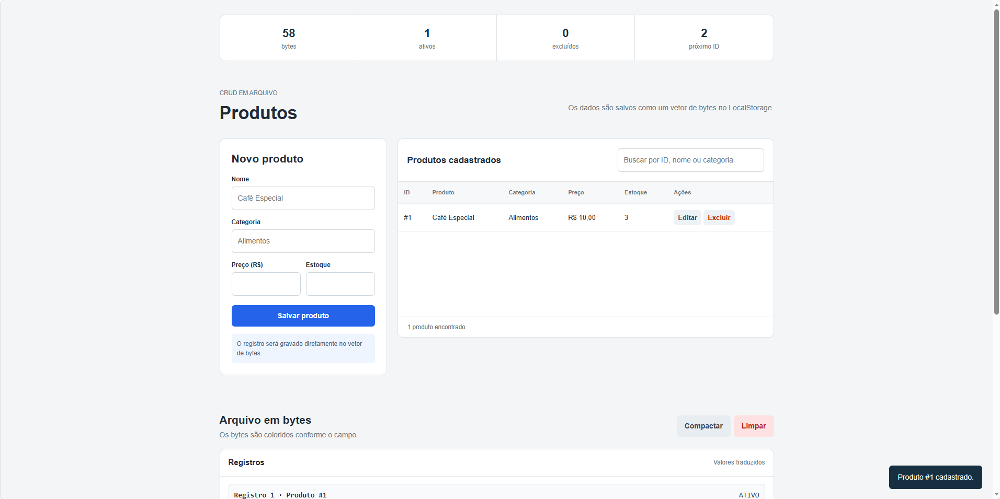

# Arquivo Vivo — TP4 de AEDs III

## Participantes

- Arthur Campos Pereira
- Felipe Barros Silva
- Mateus Martins Parreiras

## Descrição

Página web simples para visualizar o CRUD de produtos em um arquivo binário simulado.

Os dados são armazenados no LocalStorage somente como um vetor de números inteiros entre 0 e 255. Não existe vetor de objetos persistido. Inclusão, consulta, alteração e exclusão percorrem e modificam diretamente os bytes.

## Arquivos

- `index.html` — estrutura da página.
- `styles.css` — design básico e responsivo.
- `app.js` — formato binário, CRUD e controle da interface.

## Formato

O arquivo começa com um cabeçalho de 12 bytes:

- 4 bytes: último ID utilizado.
- 8 bytes: cabeça da lista de espaços vazios.

Cada registro contém:

- 1 byte de lápide: `20` para ativo e `2A` para excluído.
- 2 bytes indicando o tamanho.
- 4 bytes para o ID.
- Nome e categoria em UTF-8.
- 8 bytes para o preço.
- 4 bytes para o estoque.

## Funcionalidades

- Cadastrar, buscar, alterar e excluir produtos.
- Exclusão lógica por lápide.
- Realocação de registros que aumentam de tamanho.
- Compactação do arquivo.
- Visualização hexadecimal dos bytes.
- Leitura traduzida com nome, categoria, preço e estoque.
- Persistência no navegador.

## Como executar

Abra o arquivo `index.html` diretamente no navegador. Não é necessário instalar dependências.

## Avaliação com usuários

O grupo ainda deve aplicar o roteiro com pelo menos 10 alunos, registrar as respostas em escala Likert e incluir as médias no relatório final.

## Checklist

- **A página web com o CRUD de produtos foi criada?** Sim.
- **Há vídeo de até três minutos?** Sim.
- **O trabalho usa somente HTML, CSS e JavaScript?** Sim.
- **O relatório foi entregue no APC?** Sim.
- **O código está funcionando?** Sim.
- **O trabalho é original?** Sim.

